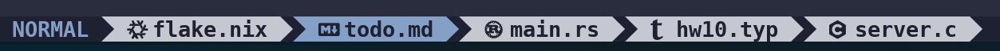

# zj-tab.nvim

<div align="center">
    
</div>
<br>

A neovim plugin that automatically updates your [Zellij](https://zellij.dev) tab names 
to match the active buffer.

## Features

- Automatically renames the current Zellij tab when switching buffers, tabs, or terminals
- Optional [nvim-web-devicons](https://github.com/nvim-tree/nvim-web-devicons) support for 
  file icons  
- Preserves the pre-Neovim tab name and restores it on exit

## Installation

Requirements:

- [Zellij](https://zellij.dev) ≥ 0.40
- Neovim ≥ 0.8
- (Optional) [nvim-web-devicons](https://github.com/nvim-tree/nvim-web-devicons) for icons  
- A Nerd Font if using devicons

Using **lazy.nvim**:

```lua
{ 
    "wizardling1/zj-tab.nvim", 
    opts = {
        -- Example options:
        enable_devicons = true,
        max_tabname_width = 30
    } 
}
```

## Commands

- `:ZJTabRefresh` - force an immediate update of the Zellij tab name
- `:ZJTabToggle` - toggle the plugin on or off (restores original tab name when disabled)

## Configuration

Defaults are shown below.

```lua
opts = {
  max_tabname_width = 20,            -- truncate tab titles
  debounce_ms = 20,                  -- debounce tab renaming
  enable_devicons = true,            -- use nvim-web-devicons if available
  multi_icon = "",                  -- shown when multiple buffers exist
  default_icon = "",                -- default icon if icon not found
  fallback_restored_tabname = "Tab", -- restored tab name if original name not found
  debug = false,                     -- enable debug notifications
}
```

## License

[LICENSE](./LICENSE)
